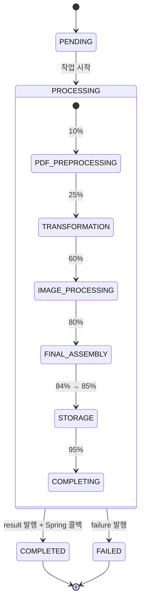
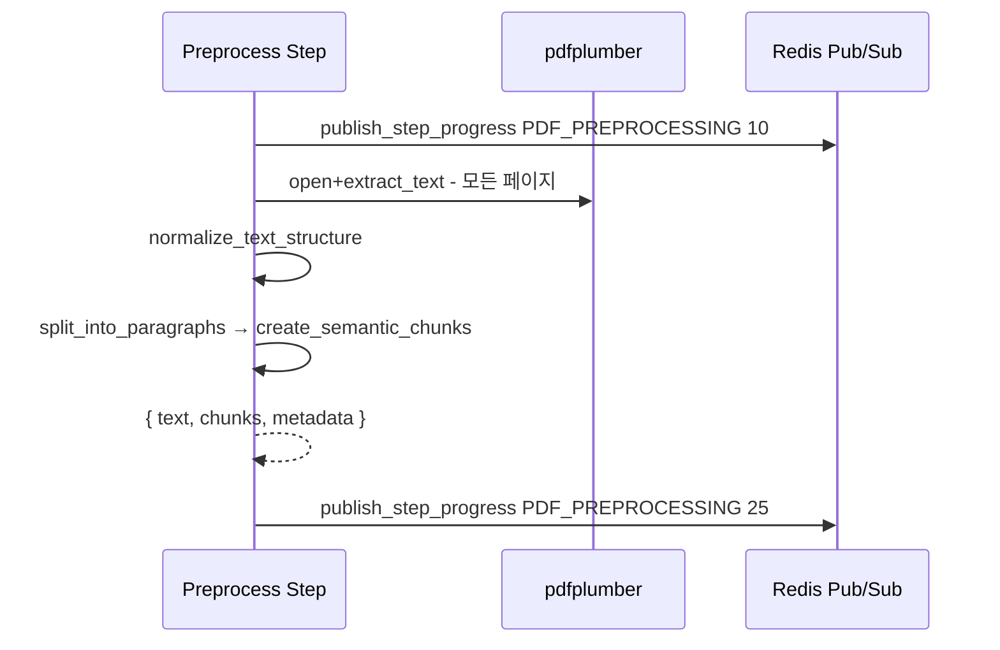
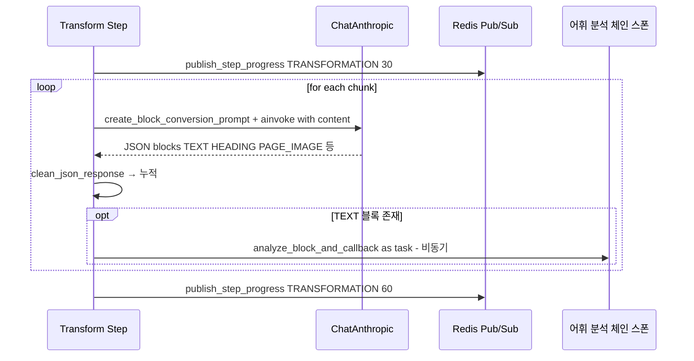
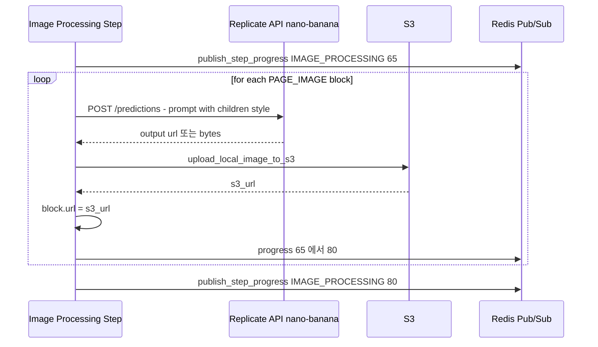
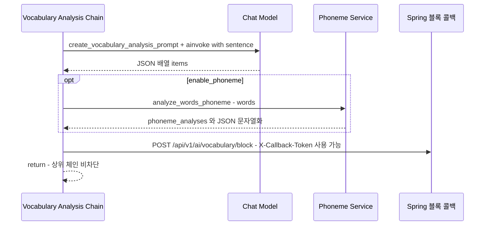
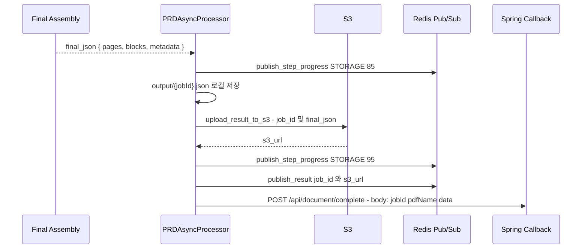
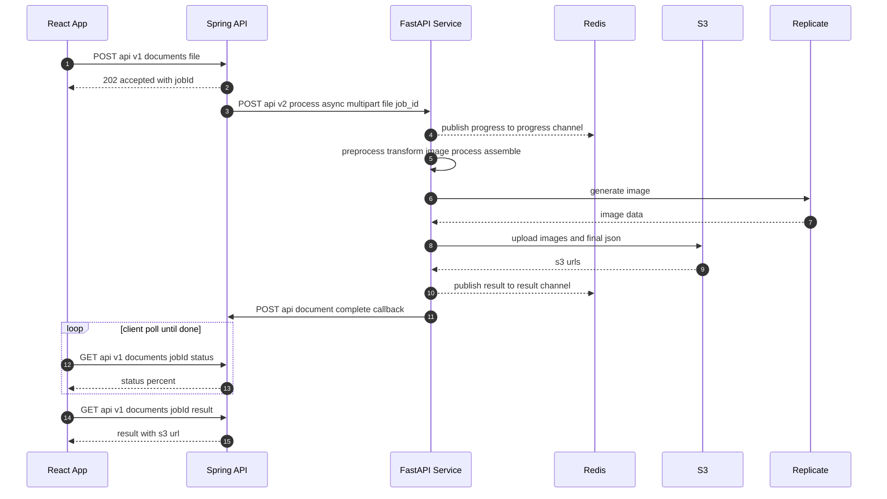

# 난독 교안 변환 체인: Mermaid 순서흐름

본 문서는 난독 교안 변환 파이프라인과 각 체인(Chain) 단위의 처리 순서를 Mermaid 다이어그램으로 요약합니다.

관련 구현 주요 위치:
- 파이프라인: `src/pipelines/main_pipeline.py`
- 전처리: `src/services/preprocessing_service.py`
- 블록 변환: `src/services/transformation_service.py`, `src/core/prompts.py`
- 이미지 처리: `src/services/image_generation_service.py`
- 어휘 분석: `src/services/vocabulary_analysis_service.py`
- 결과 저장/발행/콜백: `src/services/prd_async_processor.py`, `src/services/redis_pub_sub_service.py`, `src/services/spring_callback_service.py`

## 전체 파이프라인 개요
```mermaid
flowchart LR
  A[React Spring 업로드 multipart: file + jobId] --> B[FastAPI PRD Async Router /api/v2/process/async]
  B --> C[PRDAsyncProcessor 상태 저장 PROCESSING + progress 0]
  C --> D[LCEL Main Pipeline]

  subgraph D[LCEL Pipeline]
    D1[PDF_PREPROCESSING 텍스트 추출 정규화 시맨틱 청킹] --> D2[TRANSFORMATION LLM JSON 블록 변환]
    D2 --> D3[IMAGE_PROCESSING PAGE_IMAGE 이미지 생성 S3]
    D3 --> D4[FINAL_ASSEMBLY 페이지별 블록 집계]
  end

  D4 --> E[STORAGE output/{jobId}.json 저장 + S3 업로드]
  E --> F[Redis result-channel 발행]
  F --> G[Spring 완료 콜백 POST /api/document/complete]
  G --> H[COMPLETED]

  D2 -. 병렬 스폰 .-> I[TEXT 블록 단위 어휘 분석 체인]
  I --> J[Spring 블록 콜백 /api/v1/ai/vocabulary/block]

  C -- 오류 --> X[FAILED]
  X -.-> Y[Redis failure-channel 발행]
```

## 상태/진행률 타임라인


- 진행률 발행: `publish_step_progress(job_id, step, progress)` → Redis `progress-channel`
- 최종 결과: `publish_result(job_id, s3_url)` → Redis `result-channel`
- 실패 알림: `publish_failure(job_id, error)` → Redis `failure-channel`

## 체인별 순서흐름

### 1) 전처리 체인 (PDF_PREPROCESSING)


입력/출력:
- 입력: `file_bytes`, `filename`
- 출력: `chunks: List[str]`, `metadata`

### 2) 블록 변환 체인 (TRANSFORMATION)


특징:
- LangChain LCEL: `prompt | model`
- TEXT 블록마다 어휘 분석 체인 비동기 스폰(부하 분산)

### 3) 이미지 처리 체인 (IMAGE_PROCESSING)


토글:
- `ENABLE_IMAGE_GENERATION=true|false`

### 4) 어휘 분석 체인 (TEXT 블록 단위)


확장 포인트:
- 모델 제공자 자동 선택(OpenAI/Anthropic) 및 토큰 추정
- 실패 시 최소 1개 항목 휴리스틱 생성

### 5) 최종 조립/저장/발행/콜백 (FINAL_ASSEMBLY + STORAGE)


## Redis 채널 규격
- `progress-channel`: `{ "jobId": string, "progress": number, "step"?: string, "timestamp": string }`
- `result-channel`: `{ "jobId": string, "s3_url": string, "timestamp": string }`
- `failure-channel`: `{ "jobId": string, "error": string }`

## 추가 전체 흐름


## 참고 메모
- 파이프라인 기본 모델: `claude-sonnet-4-20250514`
- 이미지 스타일: 동화풍(Children’s illustration) 고정 가이드 적용
- S3/Replicate/Redis/Spring 설정은 `.env`와 `src/utils/env_config.py` 참조
