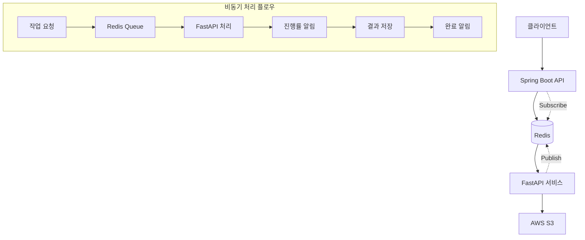

# Spring ↔ FastAPI Redis Pub/Sub 협업 가이드

## 📋 목차
1. [시스템 아키텍처](#시스템-아키텍처)
2. [API 엔드포인트](#api-엔드포인트)
3. [Redis 채널 구조](#redis-채널-구조)
4. [메시지 프로토콜](#메시지-프로토콜)
5. [작업 프로세스](#작업-프로세스)
6. [Spring 구현 가이드](#spring-구현-가이드)
7. [에러 처리](#에러-처리)
8. [모니터링 및 로깅](#모니터링-및-로깅)

## 🏗️ 시스템 아키텍처



## 📡 API 엔드포인트

### FastAPI 엔드포인트

#### 1. 교안 생성 요청 (PRD 명세)
```http
POST /api/v1/async/prd/generate-teaching-materials
Content-Type: multipart/form-data

Parameters:
- file: PDF 파일 (required)
- job_id: 작업 ID (optional, 자동 생성)
- webhook_url: 완료 시 호출할 웹훅 URL (optional)
```

**응답:**
```json
{
  "job_id": "job_20250115_123456_abc123",
  "status": "ACCEPTED",
  "message": "교안 생성 작업이 시작되었습니다.",
  "estimated_time": "5-10분",
  "created_at": "2025-01-15T12:34:56Z"
}
```

#### 2. 작업 상태 조회
```http
GET /api/v1/async/prd/status/{job_id}
```

**응답:**
```json
{
  "job_id": "job_20250115_123456_abc123",
  "status": "PROCESSING",
  "progress": 45,
  "current_step": "TRANSFORMATION",
  "message": "텍스트 변환 중...",
  "created_at": "2025-01-15T12:34:56Z",
  "updated_at": "2025-01-15T12:37:23Z",
  "estimated_remaining": "3분"
}
```

#### 3. 작업 취소
```http
DELETE /api/v1/async/prd/cancel/{job_id}
```

## 🔄 Redis 채널 구조

### 채널 네이밍 규칙
```
progress:{job_id}     # 진행률 업데이트
result:{job_id}       # 최종 결과
failure:{job_id}      # 실패 알림
step:{job_id}         # 단계별 진행률
```

### 채널별 용도
- **`progress:{job_id}`**: 전체 진행률 (0-100%)
- **`result:{job_id}`**: 완료된 결과 (S3 URL 포함)
- **`failure:{job_id}`**: 오류 발생 시 에러 정보
- **`step:{job_id}`**: 세부 단계별 진행률 및 상태

## 📨 메시지 프로토콜

### 1. 진행률 메시지 (`progress:{job_id}`)
```json
{
  "job_id": "job_20250115_123456_abc123",
  "progress": 25,
  "status": "PROCESSING",
  "message": "PDF 전처리 중...",
  "timestamp": "2025-01-15T12:35:30Z"
}
```

### 2. 단계별 진행률 (`step:{job_id}`)
```json
{
  "job_id": "job_20250115_123456_abc123",
  "step": "PREPROCESSING",
  "step_progress": 75,
  "overall_progress": 15,
  "message": "PDF 텍스트 추출 중...",
  "timestamp": "2025-01-15T12:35:30Z"
}
```

### 3. 최종 결과 메시지 (`result:{job_id}`)
```json
{
  "job_id": "job_20250115_123456_abc123",
  "status": "COMPLETED",
  "s3_url": "https://bucket.s3.amazonaws.com/results/job_20250115_123456_abc123.json",
  "total_blocks": 45,
  "processing_time": "8분 32초",
  "completed_at": "2025-01-15T12:43:02Z",
  "metadata": {
    "total_pages": 12,
    "total_chunks": 8,
    "generated_images": 15,
    "vocabulary_words": 28
  }
}
```

### 4. 실패 메시지 (`failure:{job_id}`)
```json
{
  "job_id": "job_20250115_123456_abc123",
  "status": "FAILED",
  "error_code": "PDF_PROCESSING_ERROR",
  "error_message": "PDF 파일이 손상되어 처리할 수 없습니다.",
  "failed_at": "2025-01-15T12:36:15Z",
  "retry_available": true
}
```

## ⚡ 작업 프로세스

### 전체 워크플로우
```
1. 클라이언트 → Spring: PDF 업로드 및 작업 요청
2. Spring → FastAPI: 비동기 작업 생성 요청
3. FastAPI → Redis: 작업 상태를 큐에 저장
4. FastAPI → Redis: 진행률 실시간 발행 (Pub)
5. Spring → Redis: 진행률 구독 (Sub)
6. Spring → 클라이언트: 실시간 진행률 전송 (WebSocket/SSE)
7. FastAPI → S3: 완료된 결과 저장
8. FastAPI → Redis: 완료 결과 발행
9. Spring → 클라이언트: 최종 결과 전달
```

### 단계별 세부 프로세스

#### Phase 1: 요청 접수 (0-5%)
- 파일 검증 및 임시 저장
- Job ID 생성 및 메타데이터 저장

#### Phase 2: 전처리 (5-25%)
- PDF 텍스트 추출
- 헤더/푸터 제거
- 문단 정규화
- 시맨틱 청킹

#### Phase 3: 변환 (25-80%)
- 텍스트 → 교육용 블록 변환
- 이미지 생성 요청
- 어휘 분석 및 발음 정보 추가

#### Phase 4: 후처리 (80-95%)
- 결과 집계 및 검증
- S3 업로드

#### Phase 5: 완료 (95-100%)
- 최종 결과 Redis 발행
- 메타데이터 정리

## 🌸 Spring 구현 가이드

### 1. 의존성 추가
```xml
<!-- pom.xml -->
<dependencies>
    <!-- Redis -->
    <dependency>
        <groupId>org.springframework.boot</groupId>
        <artifactId>spring-boot-starter-data-redis</artifactId>
    </dependency>

    <!-- WebSocket for real-time updates -->
    <dependency>
        <groupId>org.springframework.boot</groupId>
        <artifactId>spring-boot-starter-websocket</artifactId>
    </dependency>

    <!-- HTTP Client for FastAPI calls -->
    <dependency>
        <groupId>org.springframework.boot</groupId>
        <artifactId>spring-boot-starter-webflux</artifactId>
    </dependency>

    <!-- JSON Processing -->
    <dependency>
        <groupId>com.fasterxml.jackson.core</groupId>
        <artifactId>jackson-databind</artifactId>
    </dependency>
</dependencies>
```

### 2. Redis 설정
```java
@Configuration
@EnableConfigurationProperties(RedisProperties.class)
public class RedisConfig {

    @Bean
    public LettuceConnectionFactory redisConnectionFactory() {
        return new LettuceConnectionFactory(
            new RedisStandaloneConfiguration("localhost", 6379)
        );
    }

    @Bean
    public RedisTemplate<String, Object> redisTemplate() {
        RedisTemplate<String, Object> template = new RedisTemplate<>();
        template.setConnectionFactory(redisConnectionFactory());
        template.setDefaultSerializer(new GenericJackson2JsonRedisSerializer());
        return template;
    }

    @Bean
    public RedisMessageListenerContainer redisContainer() {
        RedisMessageListenerContainer container = new RedisMessageListenerContainer();
        container.setConnectionFactory(redisConnectionFactory());
        return container;
    }
}
```

### 3. 교안 생성 서비스
```java
@Service
@Slf4j
public class TeachingMaterialService {

    private final WebClient fastApiClient;
    private final RedisTemplate<String, Object> redisTemplate;
    private final RedisMessageListenerContainer redisContainer;

    public TeachingMaterialService(
            RedisTemplate<String, Object> redisTemplate,
            RedisMessageListenerContainer redisContainer) {
        this.redisTemplate = redisTemplate;
        this.redisContainer = redisContainer;
        this.fastApiClient = WebClient.builder()
            .baseUrl("http://localhost:10300")
            .build();
    }

    /**
     * 교안 생성 작업 시작
     */
    public Mono<JobResponse> startTeachingMaterialGeneration(
            MultipartFile file,
            String webhookUrl) {

        return fastApiClient.post()
            .uri("/api/v1/async/prd/generate-teaching-materials")
            .contentType(MediaType.MULTIPART_FORM_DATA)
            .body(BodyInserters.fromMultipartData(
                MultipartBodyBuilder.builder()
                    .part("file", file.getResource())
                    .part("webhook_url", webhookUrl)
                    .build()))
            .retrieve()
            .bodyToMono(JobResponse.class)
            .doOnNext(response -> {
                log.info("교안 생성 작업 시작: {}", response.getJobId());
                subscribeToJobProgress(response.getJobId());
            });
    }

    /**
     * 작업 상태 조회
     */
    public Mono<JobStatus> getJobStatus(String jobId) {
        return fastApiClient.get()
            .uri("/api/v1/async/prd/status/{jobId}", jobId)
            .retrieve()
            .bodyToMono(JobStatus.class);
    }

    /**
     * 작업 취소
     */
    public Mono<Void> cancelJob(String jobId) {
        return fastApiClient.delete()
            .uri("/api/v1/async/prd/cancel/{jobId}", jobId)
            .retrieve()
            .bodyToMono(Void.class);
    }

    /**
     * Redis 채널 구독
     */
    private void subscribeToJobProgress(String jobId) {
        // 진행률 채널 구독
        redisContainer.addMessageListener(
            new ProgressMessageListener(jobId),
            new PatternTopic("progress:" + jobId)
        );

        // 결과 채널 구독
        redisContainer.addMessageListener(
            new ResultMessageListener(jobId),
            new PatternTopic("result:" + jobId)
        );

        // 실패 채널 구독
        redisContainer.addMessageListener(
            new FailureMessageListener(jobId),
            new PatternTopic("failure:" + jobId)
        );

        // 단계별 진행률 채널 구독
        redisContainer.addMessageListener(
            new StepProgressMessageListener(jobId),
            new PatternTopic("step:" + jobId)
        );
    }
}
```

### 4. Redis 메시지 리스너
```java
@Component
@Slf4j
public class ProgressMessageListener implements MessageListener {

    private final String jobId;
    private final SimpMessagingTemplate messagingTemplate;
    private final ObjectMapper objectMapper;

    public ProgressMessageListener(String jobId) {
        this.jobId = jobId;
        this.messagingTemplate = ApplicationContextProvider.getBean(SimpMessagingTemplate.class);
        this.objectMapper = new ObjectMapper();
    }

    @Override
    public void onMessage(Message message, byte[] pattern) {
        try {
            String messageBody = new String(message.getBody());
            ProgressMessage progress = objectMapper.readValue(messageBody, ProgressMessage.class);

            log.info("진행률 업데이트 수신: {} - {}%", jobId, progress.getProgress());

            // WebSocket으로 클라이언트에게 실시간 전송
            messagingTemplate.convertAndSend(
                "/topic/progress/" + jobId,
                progress
            );

        } catch (Exception e) {
            log.error("진행률 메시지 처리 실패: {}", e.getMessage(), e);
        }
    }
}

@Component
@Slf4j
public class ResultMessageListener implements MessageListener {

    private final String jobId;
    private final SimpMessagingTemplate messagingTemplate;
    private final ObjectMapper objectMapper;

    @Override
    public void onMessage(Message message, byte[] pattern) {
        try {
            String messageBody = new String(message.getBody());
            ResultMessage result = objectMapper.readValue(messageBody, ResultMessage.class);

            log.info("작업 완료 결과 수신: {} - {}", jobId, result.getS3Url());

            // WebSocket으로 완료 결과 전송
            messagingTemplate.convertAndSend(
                "/topic/result/" + jobId,
                result
            );

            // 구독 해제
            unsubscribeFromJob(jobId);

        } catch (Exception e) {
            log.error("결과 메시지 처리 실패: {}", e.getMessage(), e);
        }
    }
}
```

### 5. WebSocket 설정
```java
@Configuration
@EnableWebSocketMessageBroker
public class WebSocketConfig implements WebSocketMessageBrokerConfigurer {

    @Override
    public void configureMessageBroker(MessageBrokerRegistry config) {
        config.enableSimpleBroker("/topic");
        config.setApplicationDestinationPrefixes("/app");
    }

    @Override
    public void registerStompEndpoints(StompEndpointRegistry registry) {
        registry.addEndpoint("/ws")
            .setAllowedOriginPatterns("*")
            .withSockJS();
    }
}
```

### 6. REST 컨트롤러
```java
@RestController
@RequestMapping("/api/v1/teaching-materials")
@Slf4j
public class TeachingMaterialController {

    private final TeachingMaterialService teachingMaterialService;

    /**
     * 교안 생성 요청
     */
    @PostMapping("/generate")
    public Mono<ResponseEntity<JobResponse>> generateTeachingMaterial(
            @RequestParam("file") MultipartFile file,
            @RequestParam(value = "webhook_url", required = false) String webhookUrl) {

        // 파일 검증
        if (file.isEmpty() || !file.getOriginalFilename().endsWith(".pdf")) {
            return Mono.just(ResponseEntity.badRequest().build());
        }

        return teachingMaterialService.startTeachingMaterialGeneration(file, webhookUrl)
            .map(ResponseEntity::ok)
            .onErrorReturn(ResponseEntity.internalServerError().build());
    }

    /**
     * 작업 상태 조회
     */
    @GetMapping("/status/{jobId}")
    public Mono<ResponseEntity<JobStatus>> getJobStatus(@PathVariable String jobId) {
        return teachingMaterialService.getJobStatus(jobId)
            .map(ResponseEntity::ok)
            .onErrorReturn(ResponseEntity.notFound().build());
    }

    /**
     * 작업 취소
     */
    @DeleteMapping("/cancel/{jobId}")
    public Mono<ResponseEntity<Void>> cancelJob(@PathVariable String jobId) {
        return teachingMaterialService.cancelJob(jobId)
            .map(v -> ResponseEntity.ok().<Void>build())
            .onErrorReturn(ResponseEntity.internalServerError().build());
    }
}
```

### 7. 데이터 모델
```java
// 작업 응답
@Data
public class JobResponse {
    private String jobId;
    private String status;
    private String message;
    private String estimatedTime;
    private LocalDateTime createdAt;
}

// 작업 상태
@Data
public class JobStatus {
    private String jobId;
    private String status;
    private Integer progress;
    private String currentStep;
    private String message;
    private LocalDateTime createdAt;
    private LocalDateTime updatedAt;
    private String estimatedRemaining;
}

// 진행률 메시지
@Data
public class ProgressMessage {
    private String jobId;
    private Integer progress;
    private String status;
    private String message;
    private LocalDateTime timestamp;
}

// 결과 메시지
@Data
public class ResultMessage {
    private String jobId;
    private String status;
    private String s3Url;
    private Integer totalBlocks;
    private String processingTime;
    private LocalDateTime completedAt;
    private Map<String, Object> metadata;
}
```

## ❌ 에러 처리

### 주요 에러 코드
```java
public enum ErrorCode {
    PDF_PROCESSING_ERROR("PDF_001", "PDF 처리 중 오류가 발생했습니다."),
    TRANSFORMATION_ERROR("TRANS_001", "텍스트 변환 중 오류가 발생했습니다."),
    IMAGE_GENERATION_ERROR("IMG_001", "이미지 생성 중 오류가 발생했습니다."),
    S3_UPLOAD_ERROR("S3_001", "파일 업로드 중 오류가 발생했습니다."),
    REDIS_CONNECTION_ERROR("REDIS_001", "Redis 연결 오류가 발생했습니다."),
    JOB_NOT_FOUND("JOB_001", "작업을 찾을 수 없습니다."),
    JOB_ALREADY_COMPLETED("JOB_002", "이미 완료된 작업입니다."),
    JOB_CANCELLED("JOB_003", "취소된 작업입니다."),
    FILE_TOO_LARGE("FILE_001", "파일 크기가 너무 큽니다. (최대 50MB)"),
    INVALID_FILE_FORMAT("FILE_002", "지원하지 않는 파일 형식입니다.");
}
```

### 재시도 로직
```java
@Component
public class RetryableJobService {

    @Retryable(
        value = {RedisConnectionFailureException.class},
        maxAttempts = 3,
        backoff = @Backoff(delay = 1000, multiplier = 2)
    )
    public void subscribeToRedisChannel(String jobId) {
        // Redis 구독 로직
    }

    @Recover
    public void recover(RedisConnectionFailureException ex, String jobId) {
        log.error("Redis 구독 재시도 실패: {} - {}", jobId, ex.getMessage());
        // 대체 처리 로직 (DB 폴링 등)
    }
}
```

## 📊 모니터링 및 로깅

### 메트릭 수집
```java
@Component
public class JobMetrics {

    private final Counter jobStartedCounter;
    private final Counter jobCompletedCounter;
    private final Counter jobFailedCounter;
    private final Timer jobProcessingTimer;

    public JobMetrics(MeterRegistry meterRegistry) {
        this.jobStartedCounter = Counter.builder("job.started").register(meterRegistry);
        this.jobCompletedCounter = Counter.builder("job.completed").register(meterRegistry);
        this.jobFailedCounter = Counter.builder("job.failed").register(meterRegistry);
        this.jobProcessingTimer = Timer.builder("job.processing.time").register(meterRegistry);
    }

    public void recordJobStarted() {
        jobStartedCounter.increment();
    }

    public void recordJobCompleted(Duration processingTime) {
        jobCompletedCounter.increment();
        jobProcessingTimer.record(processingTime);
    }

    public void recordJobFailed() {
        jobFailedCounter.increment();
    }
}
```

### 로깅 설정 (logback-spring.xml)
```xml
<configuration>
    <appender name="STDOUT" class="ch.qos.logback.core.ConsoleAppender">
        <encoder>
            <pattern>%d{yyyy-MM-dd HH:mm:ss} [%thread] %-5level [%X{jobId}] %logger{36} - %msg%n</pattern>
        </encoder>
    </appender>

    <logger name="com.example.teachingmaterial" level="INFO"/>
    <logger name="org.springframework.data.redis" level="DEBUG"/>

    <root level="INFO">
        <appender-ref ref="STDOUT"/>
    </root>
</configuration>
```

## 🔧 설정 파일

### application.yml
```yaml
spring:
  redis:
    host: localhost
    port: 6379
    timeout: 2000ms
    jedis:
      pool:
        max-active: 8
        max-wait: -1ms
        max-idle: 8
        min-idle: 0

  servlet:
    multipart:
      max-file-size: 50MB
      max-request-size: 50MB

fastapi:
  base-url: http://localhost:10300
  timeout: 30s

job:
  max-concurrent: 10
  cleanup-after-days: 7
  progress-update-interval: 5s

websocket:
  allowed-origins: "*"
  message-size-limit: 64KB
```

## 🚀 클라이언트 사용 예제

### JavaScript (WebSocket)
```javascript
// WebSocket 연결
const socket = new SockJS('/ws');
const stompClient = Stomp.over(socket);

// 교안 생성 요청
async function generateTeachingMaterial(file) {
    const formData = new FormData();
    formData.append('file', file);

    const response = await fetch('/api/v1/teaching-materials/generate', {
        method: 'POST',
        body: formData
    });

    const jobResponse = await response.json();
    const jobId = jobResponse.jobId;

    // 진행률 구독
    stompClient.subscribe(`/topic/progress/${jobId}`, (message) => {
        const progress = JSON.parse(message.body);
        updateProgressBar(progress.progress);
        updateStatusMessage(progress.message);
    });

    // 완료 결과 구독
    stompClient.subscribe(`/topic/result/${jobId}`, (message) => {
        const result = JSON.parse(message.body);
        handleJobCompletion(result);
    });

    return jobId;
}

function updateProgressBar(progress) {
    document.getElementById('progress-bar').style.width = progress + '%';
    document.getElementById('progress-text').textContent = progress + '%';
}

function updateStatusMessage(message) {
    document.getElementById('status-message').textContent = message;
}

function handleJobCompletion(result) {
    console.log('작업 완료:', result.s3Url);
    // 결과 다운로드 또는 표시 로직
}
```

이 가이드를 통해 Spring과 FastAPI 간의 Redis Pub/Sub 기반 협업을 구현할 수 있습니다. 실시간 진행률 업데이트와 안정적인 비동기 처리를 위한 모든 필요한 구성 요소가 포함되어 있습니다.